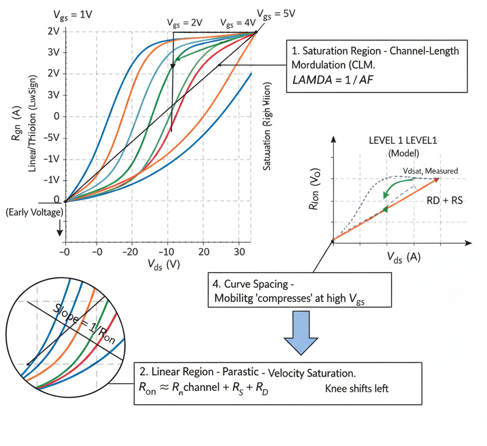

## Theory
**Introduction:**  
MOSFET Parameter Extraction from Output ($I_d$ vs. $V_d$) Characteristics

      
      
<strong>Fig. 1. MOSFET Output Characteristics: Parameter Extraction</strong>

## Introduction

The **output characteristic** plot ($I_d$ vs. $V_d$) is a fundamental MOSFET measurement. It shows how the drain current ($I_d$) varies with the drain-source voltage ($V_{ds}$), for several different constant gate-source voltages ($V_{gs}$).

This family of curves is essential for extracting parameters that model the transistor's behavior in the **linear (or triode) region** and the **saturation region**.

The plot is typically divided into two main regions:
1.  **Linear/Triode Region (Low $V_{ds}$):** The device acts like a voltage-controlled resistor. $I_d$ rises linearly (or near-linearly) with $V_{ds}$.
2.  **Saturation Region (High $V_{ds}$):** The channel "pinches off," and the device acts like a voltage-controlled current source. Ideally, $I_d$ would be constant, but real-world effects cause it to slope upwards.

---

## 1. Saturation Region - Channel-Length Modulation (LEVEL 1, 2, 3)

In the simple (LEVEL 1) model, the saturation current is assumed to be constant and independent of $V_{ds}$. In reality, the $I_d$ curves slope gently upwards.

* **Physical Cause:** This is due to **Channel-Length Modulation (CLM)**, an effect analogous to the Early effect in BJTs. As $V_{ds}$ increases, the depletion region at the drain end of the channel widens, which moves the "pinch-off" point slightly toward the source. This *reduces* the effective channel length ($L_{eff}$). Since $I_d$ is inversely proportional to $L_{eff}$, the current increases slightly.

* **SPICE Parameter:** `LAMBDA` (Channel-Length Modulation Parameter)
    * The LEVEL 1 model modifies the saturation current:
        $$I_d = I_{d,sat} \cdot (1 + \lambda \cdot V_{ds})$$

* **Extraction Method:**
    1.  For each $I_d$ curve (at a constant $V_{gs}$), draw a straight-line tangent along the sloped portion in the saturation region.
    2.  Extrapolate all these tangent lines backward. They will ideally converge at a single point on the negative $V_{ds}$ axis.
    3.  This intercept is the **Early Voltage ($VAF$ or $V_A$)**.
    4.  The `LAMBDA` parameter is the inverse of the Early Voltage:
        $$\lambda = \frac{1}{VAF}$$

---

## 2. Linear Region - Parasitic Resistances (LEVEL 3, 6)

The simple LEVEL 1 model assumes the "on-resistance" ($R_{on}$) at very low $V_{ds}$ is determined *only* by the ideal channel. In reality, parasitic resistances from the source and drain contacts/regions add to this.

* **Physical Cause:** There is a physical, ohmic resistance in the source and drain regions ($R_s$ and $R_d$) that is in series with the ideal MOSFET channel.
* **SPICE Parameters:** `RD` (Drain Resistance), `RS` (Source Resistance)
* **Effect on Plot:** These resistances "linearize" the $I_d-V_d$ curve near the origin. The slope of the curve at $V_{ds} \approx 0$ is the total on-resistance ($R_{on}$).
    $$R_{on} = \frac{V_{ds}}{I_d} = R_{channel} + RD + RS$$
* **Extraction Method:**
    1.  Measure $R_{on}$ (the slope near the origin) for several different, high $V_{gs}$ values.
    2.  The channel resistance ($R_{channel}$) *decreases* as $V_{gs}$ increases, while `RD` and `RS` are constant.
    3.  By plotting $R_{on}$ (y-axis) vs. a function of the gate voltage (e.g., $1/(V_{gs} - VTO)$) (x-axis), a straight line is obtained.
    4.  The y-intercept of this plot (where the channel resistance term goes to zero) gives the sum of the parasitic resistances, **`RD + RS`**.
    5.  (Separate `RD` and `RS` requires more advanced "Kelvin" measurement structures).

---

## 3. Saturation Knee - Velocity Saturation (LEVEL 2, 6)

For short-channel devices, the simple "pinch-off" model (LEVEL 1) breaks down. Carriers reach a maximum speed before the channel pinches off.

* **Physical Cause:** At high electric fields (high $V_{ds}$ over a short $L$), the charge carriers (electrons or holes) reach a maximum scatter-limited velocity and cannot travel any faster.
* **SPICE Parameter:** `VMAX` (Maximum Drift Velocity)
* **Effect on Plot:**
    1.  The "knee" of the curve (transition from linear to saturation) occurs at a *lower* $V_{ds}$ than LEVEL 1 predicts.
    2.  The saturated $I_d$ becomes more proportional to $(V_{gs} - VTO)$ instead of $(V_{gs} - VTO)^2$.
* **Extraction Method:** `VMAX` is a physical parameter that is difficult to extract with a simple graphical method. It is primarily a **fitting parameter**. In LEVEL 2 or LEVEL 6 (BSIM), `VMAX` is adjusted in the model until the "knee" of the output curve and the resulting saturation current level match the measured data, especially at high $V_{gs}$.

---

## 4. Curve Spacing - Mobility Degradation (LEVEL 3, 6)

The output plot also clearly *visualizes* the effect of mobility degradation, even though the parameters are typically extracted from the $I_d$ vs. $V_g$ transfer plot.

* **Physical Cause:** At high $V_{gs}$ values, the strong vertical electric field pulls carriers against the silicon-oxide interface. This increases scattering and *reduces* their mobility.
* **SPICE Parameters:** `THETA` (LEVEL 3), `U0`, `UA`, `UB`... (LEVEL 6/BSIM)
* **Effect on Plot:** The *vertical spacing* between $I_d$ curves (for constant $V_{gs}$ steps) is *not* constant. At high $V_{gs}$ levels, this spacing "compresses" or gets smaller, indicating a loss of "gain" (transconductance).
* **Extraction:** These parameters are adjusted using numerical optimization to fit this observed current compression in the high-$V_{gs}$ region of the plot.

     
 
